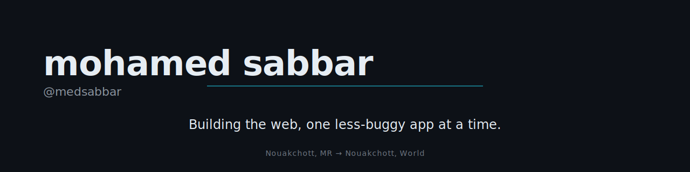

---

I'm Mohamed Sabbar — CTO at [IBTIKAR Technologies](https://www.ibtikartech.com), where we build the digital public infrastructure Mauritania runs on. Day to day I'm in Node.js, Next.js, TypeScript, MongoDB, and Firebase.

### What I'm building

Mauritania's digital government, layer by layer:

- **[Houwiyeti](https://play.google.com/store/apps/details?id=com.anrpts.houwiyeti)** — the national digital identity. Selfie-based eID that replaces passwords across government services and puts civil-registry documents (national ID, birth certificates, passports) in every citizen's pocket.
- **[Khidmaty](https://play.google.com/store/apps/details?id=mr.got.citoyens.platforme)** — the national e-services portal. One front door to public administrative procedures, integrated with Houwiyeti.
- **[Aoun](https://aoun.taazour.gov.mr/en)** — the social-support platform behind the national cash-transfer and food-aid program, reaching the country's most vulnerable families through the social registry.

### Stack

`Node.js` · `Next.js` · `TypeScript` · `MongoDB` · `Firebase`

---

Nouakchott, Mauritania

