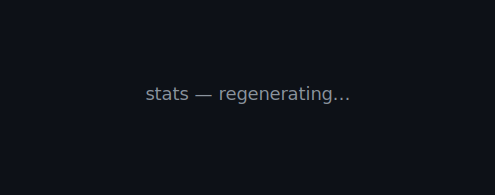
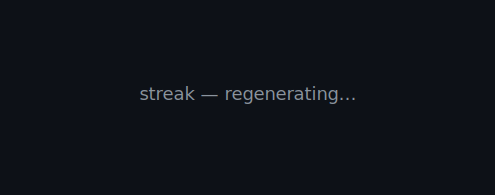

**CTO at IBTIKAR-Technologies. Building the web, one less-buggy app at a time.**

---

I lead engineering at [IBTIKAR-Technologies](https://github.com/IBTIKAR-Technologies),
where we build public-services platforms for Mauritania's government.
Most days I'm in Node.js, Next.js, MongoDB, and Firebase.

**Currently building** — Mauritanian e-government services that citizens
actually want to use.

---

### Day-to-day stack

`Node.js` · `Next.js` · `MongoDB` · `Firebase` · `TypeScript`

---

### Numbers

